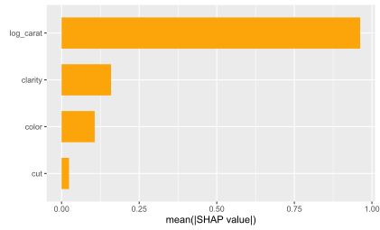
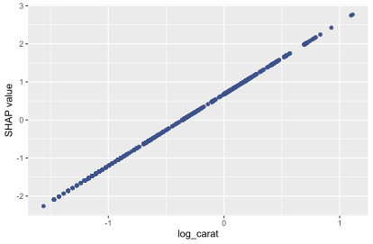
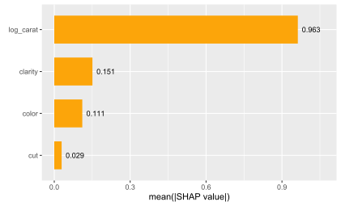

# kernelshap <a href='https://github.com/mayer79/kernelshap'></a>

## Introduction

SHAP values (Lundberg and Lee, 2017) decompose model predictions into additive contributions of the features in a fair way. A model agnostic approach is called Kernel SHAP, introduced in Lundberg and Lee (2017), and investigated in detail in Covert and Lee (2021). 

The "kernelshap" package implements the Kernel SHAP Algorithm 1 described in the supplement of Covert and Lee (2021). An advantage of their algorithm is that SHAP values are supplemented by standard errors. Furthermore, convergence can be monitored and controlled.

The main function `kernelshap()` has three key arguments:

- `X`: A matrix or data.frame of rows to be explained. Important: The columns should only represent model features, not the response.
- `pred_fun`: A function that takes a data structure like `X` and provides $K \ge 1$ numeric prediction per row. Some examples:
  - `lm()`: `function(X) predict(fit, X)`
  - `glm()`: `function(X) predict(fit, X)` (link scale) or
  - `glm()`: `function(X) predict(fit, X, type = "response")` (response scale)
  - `mgcv::gam()`: `function(X) predict(fit, X)` (link scale)
  - `mgcv::gam()`: `function(X) predict(fit, X, type = "response")` (response scale)
  - Keras: `function(X) predict(fit, X)`
  - mlr3: `function(X) fit$predict_newdata(X)$response`
  - caret: `function(X) predict(fit, X)`
- `bg_X`: The background data used to integrate out "switched off" features. It should have the same column structure as `X`. A good size is around $50-200$ rows.

**Remarks**

- *Visualization:* To visualize the result, you can use R package "shapviz".
- *Meta-learners:* "kernelshap" plays well together with packages like "caret" and "mlr3".
- *Case weights:* Passing `bg_w` allows to weight background data.
- *Classification:* `kernelshap()` requires one numeric prediction per row. Thus, the prediction function should provide probabilities only of a selected class.
- *Speed:* The algorithm has two computational bottlenecks: (1) applying the prediction function and (b) reorganizing the data. The latter is significantly faster for matrix `X`, or if the "data.table" package is available.

## Installation

``` r
# install.packages("devtools")
devtools::install_github("mayer79/kernelshap")
```

## Example: linear regression

```r
library(kernelshap)
library(shapviz)

fit <- lm(Sepal.Length ~ ., data = iris)
pred_fun <- function(X) predict(fit, X)

# Crunch SHAP values (3 seconds)
s <- kernelshap(iris[-1], pred_fun = pred_fun, bg_X = iris[-1])
s

# Output (partly)
# SHAP values of first 2 observations:
#      Sepal.Width Petal.Length Petal.Width   Species
# [1,]  0.21951350    -1.955357   0.3149451 0.5823533
# [2,] -0.02843097    -1.955357   0.3149451 0.5823533
# 
#  Corresponding standard errors (depends on seed):
#       Sepal.Width Petal.Length  Petal.Width      Species
# [1,] 4.996004e-16 4.440892e-16 8.053901e-16 7.850462e-17
# [2,] 5.516421e-16 3.510833e-16 9.436896e-16 6.661338e-16

# Plot with shapviz
shp <- shapviz(s)
sv_waterfall(shp, 1)
sv_importance(shp)
sv_dependence(shp, "Petal.Length")
```






## Example: logistic regression on probability scale

```r
library(kernelshap)
library(shapviz)

fit <- glm(I(Species == "virginica") ~ Sepal.Length + Sepal.Width, data = iris, family = binomial)
pred_fun <- function(X) predict(fit, X, type = "response")

# Crunch SHAP values
s <- kernelshap(iris[1:2], pred_fun = pred_fun, bg_X = iris[1:2])

# Plot with shapviz
shp <- shapviz(s)
sv_waterfall(shp, 51)
sv_dependence(shp, "Sepal.Length")
```


## Example: Keras neural net

```r
library(kernelshap)
library(keras)
library(shapviz)

model <- keras_model_sequential()
model %>% 
  layer_dense(units = 6, activation = "tanh", input_shape = 3) %>% 
  layer_dense(units = 1)

model %>% 
  compile(loss = "mse", optimizer = optimizer_nadam(0.005))

model %>% 
  fit(
    x = data.matrix(iris[2:4]), 
    y = iris[, 1],
    epochs = 50,
    batch_size = 30
  )

X <- data.matrix(iris[2:4])
pred_fun <- function(X) as.numeric(predict(model, X, batch_size = nrow(X)))

# Crunch SHAP values (22 seconds)
system.time(
  s <- kernelshap(X, pred_fun = pred_fun, bg_X = X)
)

# Plot with shapviz (results depend on neural net seed)
shp <- shapviz(s)
sv_waterfall(shp, 1)
sv_importance(shp)
sv_dependence(shp, "Petal.Length")
```





### Example: mlr3

```R
library(mlr3)
library(mlr3learners)
library(kernelshap)
library(shapviz)

mlr_tasks$get("iris")
tsk("iris")
task_iris <- TaskRegr$new(id = "iris", backend = iris, target = "Sepal.Length")
fit_lm <- lrn("regr.lm")
fit_lm$train(task_iris)
s <- kernelshap(iris, function(X) fit_lm$predict_newdata(X)$response, bg_X = iris)
sv <- shapviz(s)
sv_dependence(sv, "Species")
```


### Example: caret

```r
library(caret)
library(kernelshap)
library(shapviz)

fit <- train(
  Sepal.Length ~ ., 
  data = iris, 
  method = "lm", 
  tuneGrid = data.frame(intercept = TRUE),
  trControl = trainControl(method = "none")
)

s <- kernelshap(iris[1, -1], function(X) predict(fit, X), bg_X = iris[-1])
sv <- shapviz(s)  # until shapviz 0.2.0: shapviz(s$S, s$X, s$baseline)
sv_waterfall(sv, 1)
```


## References

[1] Scott M. Lundberg and Su-In Lee. A Unified Approach to Interpreting Model Predictions. Advances in Neural Information Processing Systems 30, 2017.

[2] Ian Covert and Su-In Lee. Improving KernelSHAP: Practical Shapley Value Estimation Using Linear Regression. Proceedings of The 24th International Conference on Artificial Intelligence and Statistics, PMLR 130:3457-3465, 2021.
