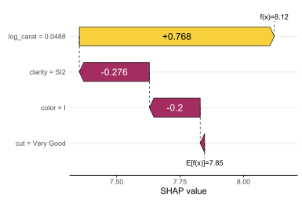

# kernelshap <a href='https://github.com/mayer79/kernelshap'></a>

## Introduction

SHAP values [1] decompose model predictions into additive contributions of the features in a fair way. A model agnostic approach is called Kernel SHAP, introduced in [1], and investigated in detail in [2]. 

The "kernelshap" package implements the basic Kernel SHAP Algorithm 1 described in detail in the supplement of [2]. An advantage of their algorithm is that SHAP values are supplemented by standard errors. Furthermore, convergence can be monitored and controlled.

The main function, `kernelshap()`, requires these three arguments:

- `X`: A matrix or data.frame of rows to be explained. Important: For each column and each row, a SHAP value is calculated. The columns should thus only represent model features, not the response.
- `pred_fun`: A function that takes a data structure like `X` and provides one numeric prediction per row. Some examples regarding a model `fit`:
  - `lm()`: `function(X) predict(fit, X)`
  - `glm()`: `function(X) predict(fit, X)` (link scale) or
  - `glm()`: `function(X) predict(fit, X, type = "response")` (response scale)
  - `mgcv::gam()`: Same as for `glm()`
  - Keras: `as.numeric(predict(fit, X))`
- `bg_X`: The background data used to integrate out features "switched off". It should have the same column structure as `X`. A good size is around $100-200$ rows.

**Remarks**

- Case weights: Passing `bg_w` allows to respect case weights of the background data.
- Visualizations: In order to visualize the result, you can use R package "shapviz".
- The prediction function can also contain preprocessing steps.

## Installation

``` r
# install.packages("devtools")
devtools::install_github("mayer79/kernelshap")
```

## Example: linear regression

```r
library(kernelshap)
library(shapviz)

fit <- lm(Sepal.Length ~ ., data = iris)
pred_fun <- function(X) predict(fit, X)

# Crunch SHAP values (15 seconds)
s <- kernelshap(iris[-1], pred_fun = pred_fun, iris[-1])

# Plot with shapviz
shp <- shapviz(s$S, s$X, s$baseline)
sv_waterfall(shp, 1)
sv_importance(shp)
sv_dependence(shp, "Petal.Length")
```




## Example: logistic regression on probability scale

```r
library(kernelshap)
library(shapviz)

fit <- glm(I(Species == "virginica") ~ Sepal.Length + Sepal.Width, data = iris, family = binomial)
pred_fun <- function(X) predict(fit, X, type = "response")

# Crunch SHAP values (10 seconds)
s <- kernelshap(iris[1:2], pred_fun = pred_fun)

# Plot with shapviz
shp <- shapviz(s$S, s$X, s$baseline)
sv_waterfall(shp, 51)
sv_dependence(shp, "Sepal.Length")
```


## Example: Keras neural net

```r
library(kernelshap)
library(keras)
library(shapviz)

model <- keras_model_sequential()
model %>% 
  layer_dense(units = 6, activation = "tanh", input_shape = 3) %>% 
  layer_dense(units = 1)

model %>% 
  compile(loss = "mse", optimizer = optimizer_nadam(0.005))

model %>% 
  fit(
    x = data.matrix(iris[2:4]), 
    y = iris[, 1],
    epochs = 50,
    batch_size = 30
  )

X <- data.matrix(iris[2:4])
pred_fun <- function(X) as.numeric(predict(model, X, batch_size = nrow(X)))

# Crunch SHAP values

# Takes about 40 seconds
system.time(
  s <- kernelshap(X, pred_fun = pred_fun)
)

# Plot with shapviz
shp <- shapviz(s$S, s$X, s$baseline)
sv_waterfall(shp, 1)
sv_importance(shp)
sv_dependence(shp, "Petal.Length")
```


## References

[1] Scott M. Lundberg and Su-In Lee. A Unified Approach to Interpreting Model Predictions. Advances in Neural Information Processing Systems 30, 2017.

[2] Ian Covert and Su-In Lee. Improving KernelSHAP: Practical Shapley Value Estimation Using Linear Regression. Proceedings of The 24th International Conference on Artificial Intelligence and Statistics, PMLR 130:3457-3465, 2021.
